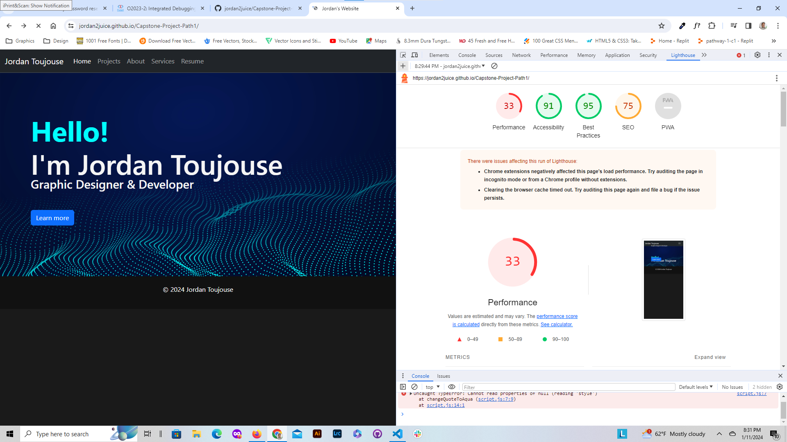
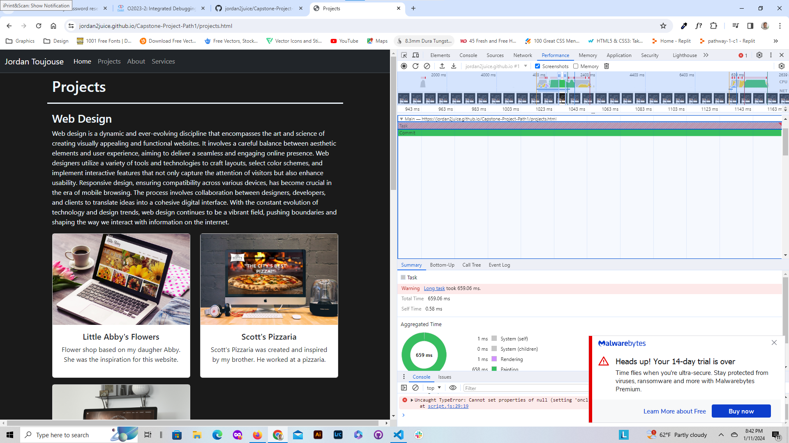
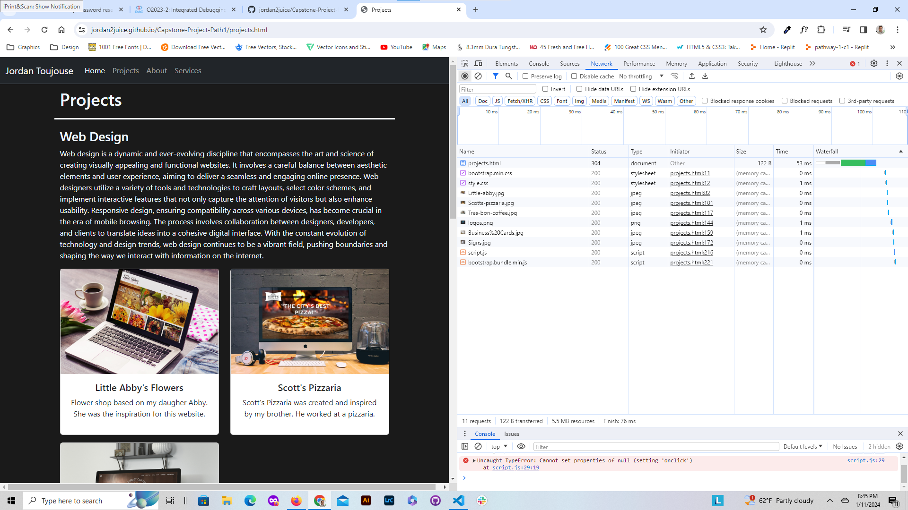

# Performance Evaluation of Capstone Project

## Lighthouse Evaluation

The home screen evaluation of my site I have a very low performance and a low SEO rating.

Part of the problem is that the hero image in the background is to big.  Will have to make it smaller.

My loading time for my javascipt is taking to long.

__SEO:__
- There are no meta tags describing the page (title, description).
- It needs better descriptive links.
- The hero image does not have an alt attribute.

## Performance

Looks like my javascript is taking a while to load.  I think it is because of the bootstrap.

Also it seems that I have tasks that are taking to long to load.

## Network

Looking at the network of my projects page my html file takes the longest to upload.